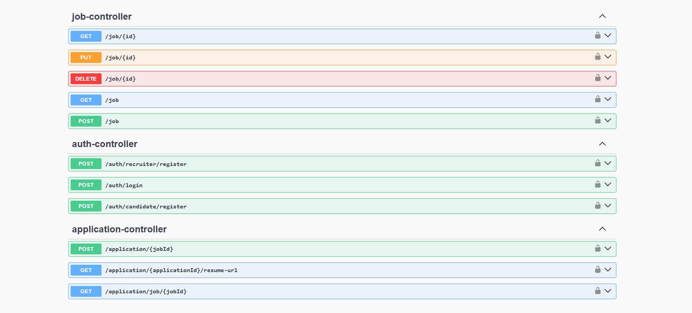
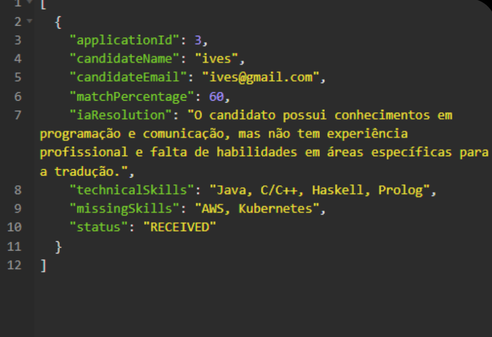

#  TalentForge AI - API de Recrutamento Inteligente


**TalentForge** é uma API RESTful robusta desenvolvida para modernizar processos de recrutamento. O diferencial do projeto é a utilização de **Inteligência Artificial Generativa (LLM)** para analisar currículos em PDF, comparar com os requisitos da vaga e gerar um "Match Score" e feedback técnico automaticamente.

---

##  Demonstração e Documentação

A API é totalmente documentada via **Swagger / OpenAPI**.



### Exemplo de Análise da IA
Abaixo, o JSON de resposta gerado pela IA ao analisar um currículo PDF real:



---

##  Tecnologias Utilizadas

O projeto foi construído seguindo os princípios de **Clean Architecture** e **Domain-Driven Design (DDD)** para garantir desacoplamento e manutenibilidade.

* **Linguagem:** Java 21
* **Framework:** Spring Boot 3
* **IA & LLM:** Spring AI (Integrado com Groq/Llama 3 via driver OpenAI)
* **Banco de Dados:** PostgreSQL
* **Migração de Dados:** Flyway
* **Segurança:** Spring Security + JWT (Stateless)
* **Containerização:** Docker & Docker Compose
* **Documentação:** SpringDoc (Swagger UI)

---

##  Arquitetura do Projeto

O sistema está dividido em camadas para isolar regras de negócio de frameworks externos:

```text
com.talentForge.api
├── application      # Casos de uso (Services)
├── domain           # Entidades, Interfaces de Repositório e Regras de Negócio (Core)
└── infrastructure   # Implementações (JPA, Controllers, Configs, Security, External APIs)